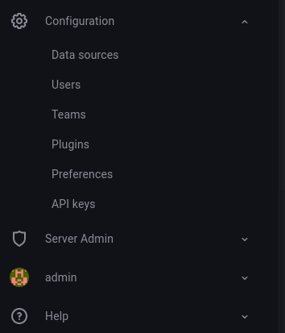
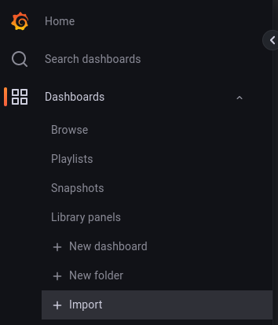
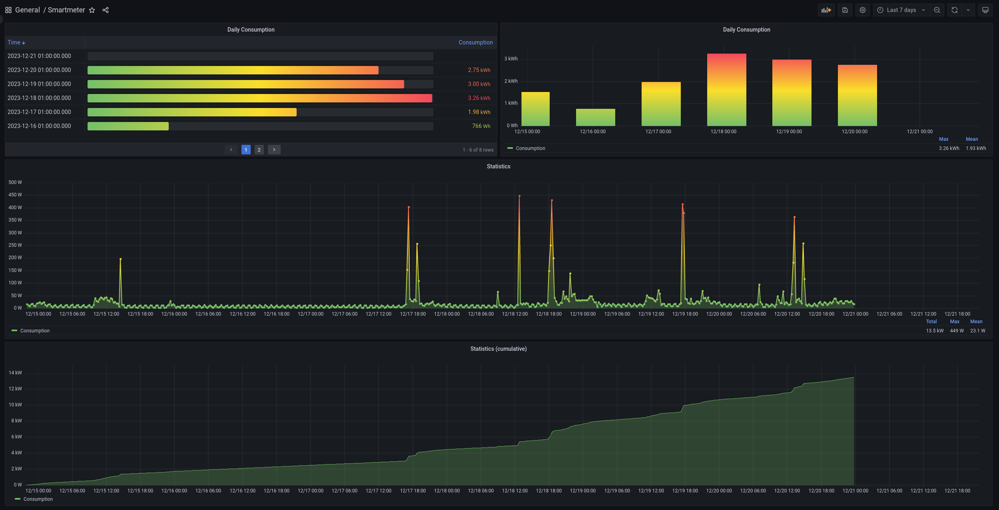

# WienerNetzeSmartmeter to InfluxDb/Grafana
- Transfer data from [WienerNetze Smartmeter](https://www.wienernetze.at/smartmeter) to local [InfluxDb](https://www.influxdata.com/)
- Visualize data with [Grafana](https://grafana.com/)

It works, but is still work in progress.

## Motivation
1. Since I like to have control over my data, I usually try to store data in my own database rather than relying on some company's database.
2. It is nice to get a visualization by [WienerNetze Smartmeter](https://www.wienernetze.at/smartmeter), which is quite good, but I like it clean in one view with Grafana.

## Setup
This package can be used on any machine which can run InfluxDb, Granfana and Python.<br>
It is designed to run on a Raspberry Pi (>3B).

### Software
A simple starting point for setting up Grafana and InfluxDb on a Raspberry Pi without deep Linux knowledge would be [IOTStack](https://sensorsiot.github.io/IOTstack/).
This is a simple and user friendly shell based tool to build a docker stack.

The script can be executed on a Raspberry Pi by using cron. You can read about cron here: [CronHowTo](https://help.ubuntu.com/community/CronHowto)

**tl;dr:**
Execute the following command to edit the cron table:

```sh
crontab -e
```
Add a new entry to the crontab like:

```
0 6 * * * /usr/bin/python3 /home/path/to/script/smartmeter/main.py >> /home/path/to/script/smartmeter/raspi_monitoring_stdio.log
```
This will execute the script every day at 6 a.m.

You can read about the crontab configuration on the manpage (manual) by just executing `man 5 crontab` in the Linux shell or use a [Crontab Generator](https://crontab-generator.org/) to generate the needed crontab entry.

### Configuration
Create a `settings.toml` file in the root directory and paste the following content whereby updating the values to your needs.

```toml
[smartmeter]
username = "Your_ViennaSmartMeter_Username"
password = "Your_ViennaSmartMeter_Password"

[influxdb]
ip = "192.168.8.XXX"
port = "8086"
database = "smartmeter"

[influxdb.measurements]
statistics = "statistics"
meter_reading = "meter_reading"
daily_consumption = "daily_consumption"
```

### Grafana
Add the InfluxDb database as datasource as follows:<br>
- Configuration -> Data sources<br>

- Add data source -> InfluxDb
- Configuration:
  - *Name:* Smartmeter
  - *URL:* \<url\>:\<port\> e.g. 192.168.8.25:8086 or in case the InfluxDb is running in a container \<container\>:\<port\> e.g. influxdb:8086
  - *Database:* smartmeter
  - *Save & Test*

The json model of the Grafana dashboard can be found here [Smartmeter Model](grafana/smartmeter.json).<br>
The model can be imported as follows:<br>
<br>
The model is configured to work with the values specified in the `settings.toml` as shown in [Configuration](#Configuration).

Grafana dashboard:<br>


Command line interface:
```
usage: main.py [-h] [--debug] [--statistics] [--meter-readings] [--daily-consumption] [--all] [--date-from DATE_FROM]
               [--date-to DATE_TO] [--import-csv IMPORT_CSV] [--test] [--log LOG]

options:
  -h, --help            show this help message and exit
  --debug               Enable debug log
  --statistics, -s      Get statistics data
  --meter-readings, -m  Get statistics data
  --daily-consumption, -d
                        Get statistics data
  --all, -a             Get statistics data
  --date-from DATE_FROM
                        ISOformat: YYYY-MM-DD; if date-to is not specified, today is used as date-to
  --date-to DATE_TO     ISOformat: YYYY-MM-DD
  --import-csv IMPORT_CSV, -i IMPORT_CSV
                        Impot export from smartmeter website
  --test
  --log LOG, -l LOG     Log file path

```


## Attribution/Copyright
- [DarwinsBuddy](https://github.com/DarwinsBuddy) base for this development
- [platrysma](https://github.com/platysma) base for WienerNetzeSmartmeter [DarwinsBuddy](https://github.com/DarwinsBuddy/WienerNetzeSmartmeter)
- [florianL21](https://github.com/florianL21) base for WienerNetzeSmartmeter [DarwinsBuddy](https://github.com/DarwinsBuddy/WienerNetzeSmartmeter)
